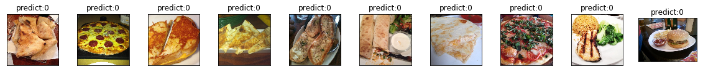
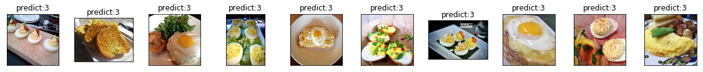
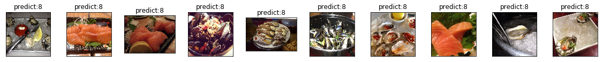

```python
# 查看当前挂载的数据集目录, 该目录下的变更重启环境后会自动还原
# View dataset directory. 
# This directory will be recovered automatically after resetting environment. 
!ls /home/aistudio/data
```

    data95924


**解压数据集**

解压后共有三个文件夹，training，validation，还有一个test


```python
!unzip -o -q -d  /home/aistudio/work data/data95924/food-11.zip
```

#  项目背景

**生活中有各种各样的食物，利用计算机视觉，结合深度学习，让机器也能识别人类世界中的食物，还是挺有意思的。**

**项目基于飞桨图像分类套件PaddleClas，可以快速实现模型训练与预测。**

相关学习内容：[AI达人创造营](https://aistudio.baidu.com/aistudio/education/group/info/24607)


```python
#导入相关库
import os
import random
import re
import matplotlib.pyplot as plt
import PIL.Image as Image
import paddle
import numpy as np
```


```python
# 安装paddleclas，版本为2.1
!git clone https://gitee.com/paddlepaddle/PaddleClas.git -b release/2.1
```

    Cloning into 'PaddleClas'...
    remote: Enumerating objects: 538, done.
    remote: Counting objects: 100% (538/538), done.
    remote: Compressing objects: 100% (323/323), done.
    remote: Total 15290 (delta 347), reused 349 (delta 210), pack-reused 14752
    Receiving objects: 100% (15290/15290), 113.56 MiB | 13.68 MiB/s, done.
    Resolving deltas: 100% (10239/10239), done.
    Checking connectivity... done.


```python
# 进入到 PaddleClas
%cd PaddleClas
```

    /home/aistudio/PaddleClas


```python
# 把food-11文件夹移动到dataset文件夹中
!mv ../work/food-11/ dataset/
```

#  数据介绍

数据来自[AIstudio公开数据集](https://aistudio.baidu.com/aistudio/datasetoverview)：**food-11**。

数据包括了11个食物种类：

> 0:"面包",1:"乳制品",2:"甜点",3:"鸡蛋",4:"油炸食品", 5:"肉类",6:"面条/意大利面",7:"米饭",8:"海鲜",9:"汤",10:"蔬菜/水果" 


```python
food_class = { 0:"面包",1:"乳制品",2:"甜点",3:"鸡蛋",4:"油炸食品",
               5:"肉类",6:"面条/意大利面",7:"米饭",8:"海鲜",9:"汤",10:"蔬菜/水果" }
```


```python
# 查看图片数据
def img_show(img, title='', cmap=None):
    fig = plt.imshow(img, interpolation='nearest', cmap=cmap)
    fig.axes.get_xaxis().set_visible(False)
    fig.axes.get_yaxis().set_visible(False)
    plt.title(title)

plt.figure(figsize=(20, 20))
for i in range(11):
    plt.subplot(11, 1, i + 1)
    fig = img_show(plt.imread(f'dataset/food-11/training/{i}_{i*10}.jpg'), title=str(i))
```


## 划分数据集


```python
# 统计训练集图片与验证集图片数量
train_Path = 'dataset/food-11/training'
vali_path = 'dataset/food-11/validation'
trainfood_list = os.listdir(train_Path)
valifood_list = os.listdir(vali_path)
random.shuffle(trainfood_list)
random.shuffle(valifood_list)
print(len(trainfood_list))
print(trainfood_list[0:2])
print(len(valifood_list))
print(valifood_list[0:2])
```

    9866
    ['5_1288.jpg', '9_12.jpg']
    3430
    ['7_14.jpg', '3_222.jpg']


## 获取图片ID与标签


```python
data_train_list = [] #用1个列表保存每个训练样本的读取路径以及标签
for each in trainfood_list:
    data_train_list.append([each,int(re.findall(r"(\d+)_",each)[0])]) #利用正则表达式获取 _ 前的图片标签
random.shuffle(data_train_list)
print(len(data_train_list))
print(data_train_list[0:3]) #查看打乱顺序后的信息
```

    9866
    [['3_836.jpg', 3], ['9_1269.jpg', 9], ['0_44.jpg', 0]]


```python
data_vali_list = []  # 用个列表保存每个测试样本的读取路径以及标签
for each in valifood_list:
    data_vali_list.append([each,int(re.findall(r"(\d+)_",each)[0])]) #利用正则表达式获取 _ 前的图片标签
print(len(data_vali_list))
print(data_vali_list[0:3])
```

    3430
    [['7_14.jpg', 7], ['3_222.jpg', 3], ['9_0.jpg', 9]]


## 数据信息写入文档

这里存储的是相对路径，当前环境是在**PaddleClas**目录下，图片数据保存在根目录**PaddleClas/dataset/food-11**下，保存图片路径时要使用**相对路径**。

同时，在保存图片对应的标签值时，路径与标签之间用空格隔开。

> 例如，保存在train_list.txt中的数据信息：training/3_836.jpg 3


```python
f = open('dataset/food-11/train_list.txt','w')
for each in data_train_list:
    info = 'training/'+ each[0] + ' ' + str(each[1]) + '\n'
    f.write(info)
```


```python
f = open('dataset/food-11/vali_list.txt','w')
for each in data_vali_list:
    info = 'validation/'+each[0] + ' ' + str(each[1]) + '\n'
    f.write(info)
```

# 训练与验证

## 配置文件

训练之前需要设置配置文件，配置文件都保存在**PaddleClas/configs**文件下。

以**HRNet/HRNet_W64_C.yaml**为例，设置配置文件训练自己的数据集。

**如下图所示，改几个关键地方就可以快速开始训练了，其他的都默认的来。**


## 开始训练
**使用下面代码直接开始训练， -c 后面要指明配置文件路径，也是相对路径**

**训练三个网络：HRNet_W64_C，SE_ResNeXt101_32x4d，ShuffleNetV2_swish。**

**训练HRNet_W64_C**


```python
%cd PaddleClas
!python ./tools/train.py -c ./configs/HRNet/HRNet_W64_C.yaml
```

## 验证模型

**按照下面代码还接开始验证，使用-o 指明需要使用的模型路径，不需要后缀.pdparams**


```python
# 'top1_acc': 0.8271137029367007
!python tools/eval.py -c ./configs/HRNet/HRNet_W64_C.yaml -o pretrained_model="./output/HRNet_W64_C/best_model/ppcls" \
    -o load_static_weights=False
```

    2021-08-12 09:24:33 WARNING: A new filed (load_static_weights) detected!
    2021-08-12 09:24:33 INFO: 
    ===========================================================
    ==        PaddleClas is powered by PaddlePaddle !        ==
    ===========================================================
    ==                                                       ==
    ==   For more info please go to the following website.   ==
    ==                                                       ==
    ==       https://github.com/PaddlePaddle/PaddleClas      ==
    ===========================================================
    
    2021-08-12 09:24:33 INFO: ARCHITECTURE : 
    2021-08-12 09:24:33 INFO:     name : HRNet_W64_C
    2021-08-12 09:24:33 INFO: ------------------------------------------------------------
    2021-08-12 09:24:33 INFO: LEARNING_RATE : 
    2021-08-12 09:24:33 INFO:     function : Piecewise
    2021-08-12 09:24:33 INFO:     params : 
    2021-08-12 09:24:33 INFO:         decay_epochs : [30, 60, 90]
    2021-08-12 09:24:33 INFO:         gamma : 0.1
    2021-08-12 09:24:33 INFO:         lr : 0.1
    2021-08-12 09:24:33 INFO: ------------------------------------------------------------
    2021-08-12 09:24:33 INFO: OPTIMIZER : 
    2021-08-12 09:24:33 INFO:     function : Momentum
    2021-08-12 09:24:33 INFO:     params : 
    2021-08-12 09:24:33 INFO:         momentum : 0.9
    2021-08-12 09:24:33 INFO:     regularizer : 
    2021-08-12 09:24:33 INFO:         factor : 0.0001
    2021-08-12 09:24:33 INFO:         function : L2
    2021-08-12 09:24:33 INFO: ------------------------------------------------------------
    2021-08-12 09:24:33 INFO: TRAIN : 
    2021-08-12 09:24:33 INFO:     batch_size : 64
    2021-08-12 09:24:33 INFO:     data_dir : ./dataset/food-11/
    2021-08-12 09:24:33 INFO:     file_list : ./dataset/food-11/train_list.txt
    2021-08-12 09:24:33 INFO:     num_workers : 0
    2021-08-12 09:24:33 INFO:     shuffle_seed : 0
    2021-08-12 09:24:33 INFO:     transforms : 
    2021-08-12 09:24:33 INFO:         DecodeImage : 
    2021-08-12 09:24:33 INFO:             channel_first : False
    2021-08-12 09:24:33 INFO:             to_rgb : True
    2021-08-12 09:24:33 INFO:         RandCropImage : 
    2021-08-12 09:24:33 INFO:             size : 224
    2021-08-12 09:24:33 INFO:         RandFlipImage : 
    2021-08-12 09:24:33 INFO:             flip_code : 1
    2021-08-12 09:24:33 INFO:         NormalizeImage : 
    2021-08-12 09:24:33 INFO:             mean : [0.485, 0.456, 0.406]
    2021-08-12 09:24:33 INFO:             order : 
    2021-08-12 09:24:33 INFO:             scale : 1./255.
    2021-08-12 09:24:33 INFO:             std : [0.229, 0.224, 0.225]
    2021-08-12 09:24:33 INFO:         ToCHWImage : None
    2021-08-12 09:24:33 INFO: ------------------------------------------------------------
    2021-08-12 09:24:33 INFO: VALID : 
    2021-08-12 09:24:33 INFO:     batch_size : 64
    2021-08-12 09:24:33 INFO:     data_dir : ./dataset/food-11/
    2021-08-12 09:24:33 INFO:     file_list : ./dataset/food-11/vali_list.txt
    2021-08-12 09:24:33 INFO:     num_workers : 0
    2021-08-12 09:24:33 INFO:     shuffle_seed : 0
    2021-08-12 09:24:33 INFO:     transforms : 
    2021-08-12 09:24:33 INFO:         DecodeImage : 
    2021-08-12 09:24:33 INFO:             channel_first : False
    2021-08-12 09:24:33 INFO:             to_rgb : True
    2021-08-12 09:24:33 INFO:         ResizeImage : 
    2021-08-12 09:24:33 INFO:             resize_short : 256
    2021-08-12 09:24:33 INFO:         CropImage : 
    2021-08-12 09:24:33 INFO:             size : 224
    2021-08-12 09:24:33 INFO:         NormalizeImage : 
    2021-08-12 09:24:33 INFO:             mean : [0.485, 0.456, 0.406]
    2021-08-12 09:24:33 INFO:             order : 
    2021-08-12 09:24:33 INFO:             scale : 1.0/255.0
    2021-08-12 09:24:33 INFO:             std : [0.229, 0.224, 0.225]
    2021-08-12 09:24:33 INFO:         ToCHWImage : None
    2021-08-12 09:24:33 INFO: ------------------------------------------------------------
    2021-08-12 09:24:33 INFO: classes_num : 11
    2021-08-12 09:24:33 INFO: epochs : 120
    2021-08-12 09:24:33 INFO: image_shape : [3, 224, 224]
    2021-08-12 09:24:33 INFO: load_static_weights : False
    2021-08-12 09:24:33 INFO: ls_epsilon : -1
    2021-08-12 09:24:33 INFO: mode : train
    2021-08-12 09:24:33 INFO: model_save_dir : ./output/
    2021-08-12 09:24:33 INFO: pretrained_model : ./output/HRNet_W64_C/best_model/ppcls
    2021-08-12 09:24:33 INFO: save_interval : 10
    2021-08-12 09:24:33 INFO: topk : 1
    2021-08-12 09:24:33 INFO: total_images : 13296
    2021-08-12 09:24:33 INFO: use_mix : False
    2021-08-12 09:24:33 INFO: valid_interval : 1
    2021-08-12 09:24:33 INFO: validate : True
    W0812 09:24:33.526798   744 device_context.cc:404] Please NOTE: device: 0, GPU Compute Capability: 7.0, Driver API Version: 10.1, Runtime API Version: 10.1
    W0812 09:24:33.531862   744 device_context.cc:422] device: 0, cuDNN Version: 7.6.
    2021-08-12 09:24:45 INFO: Finish load pretrained model from ./output/HRNet_W64_C/best_model/ppcls
    2021-08-12 09:24:45 INFO: valid step:0   , top1: 0.84375, loss: 0.54707, lr: 0.000000, batch_cost: 0.83767 s, reader_cost: 0.58667 s, ips: 76.40237 images/sec
    2021-08-12 09:24:51 INFO: valid step:10  , top1: 0.85938, loss: 0.64392, lr: 0.000000, batch_cost: 0.51850 s, reader_cost: 0.27226 s, ips: 123.43302 images/sec
    2021-08-12 09:24:58 INFO: valid step:20  , top1: 0.79688, loss: 0.91607, lr: 0.000000, batch_cost: 0.69488 s, reader_cost: 0.44856 s, ips: 92.10226 images/sec
    2021-08-12 09:25:06 INFO: valid step:30  , top1: 0.87500, loss: 0.41079, lr: 0.000000, batch_cost: 0.71807 s, reader_cost: 0.47176 s, ips: 89.12804 images/sec
    2021-08-12 09:25:12 INFO: valid step:40  , top1: 0.78125, loss: 0.77639, lr: 0.000000, batch_cost: 0.68122 s, reader_cost: 0.43488 s, ips: 93.94867 images/sec
    2021-08-12 09:25:18 INFO: valid step:50  , top1: 0.87500, loss: 0.52400, lr: 0.000000, batch_cost: 0.67177 s, reader_cost: 0.42540 s, ips: 95.27064 images/sec
    2021-08-12 09:25:20 INFO: END epoch:0   valid top1: 0.82711, loss: 0.65810,  batch_cost: 0.66015 s, reader_cost: 0.41566 s, batch_cost_sum: 29.04669 s, ips: 57.56251 images/sec.
    {'top1_acc': 0.8271137029367007}


**训练SE_ResNeXt101_32x4d**


```python
!python ./tools/train.py -c ./configs/SENet/SE_ResNeXt101_32x4d.yaml
```


```python
# 'top1_acc': 0.8107871721159265
!python tools/eval.py -c ./configs/SENet/SE_ResNeXt101_32x4d.yaml -o pretrained_model="./output/SE_ResNeXt101_32x4d/best_model/ppcls" \
    -o load_static_weights=False
```

    2021-08-12 09:28:09 WARNING: A new filed (load_static_weights) detected!
    2021-08-12 09:28:09 INFO: 
    ===========================================================
    ==        PaddleClas is powered by PaddlePaddle !        ==
    ===========================================================
    ==                                                       ==
    ==   For more info please go to the following website.   ==
    ==                                                       ==
    ==       https://github.com/PaddlePaddle/PaddleClas      ==
    ===========================================================
    
    2021-08-12 09:28:09 INFO: ARCHITECTURE : 
    2021-08-12 09:28:09 INFO:     name : SE_ResNeXt101_32x4d
    2021-08-12 09:28:09 INFO: ------------------------------------------------------------
    2021-08-12 09:28:09 INFO: LEARNING_RATE : 
    2021-08-12 09:28:09 INFO:     function : Cosine
    2021-08-12 09:28:09 INFO:     params : 
    2021-08-12 09:28:09 INFO:         lr : 0.1
    2021-08-12 09:28:09 INFO: ------------------------------------------------------------
    2021-08-12 09:28:09 INFO: OPTIMIZER : 
    2021-08-12 09:28:09 INFO:     function : Momentum
    2021-08-12 09:28:09 INFO:     params : 
    2021-08-12 09:28:09 INFO:         momentum : 0.9
    2021-08-12 09:28:09 INFO:     regularizer : 
    2021-08-12 09:28:09 INFO:         factor : 1.5e-05
    2021-08-12 09:28:09 INFO:         function : L2
    2021-08-12 09:28:09 INFO: ------------------------------------------------------------
    2021-08-12 09:28:09 INFO: TRAIN : 
    2021-08-12 09:28:09 INFO:     batch_size : 64
    2021-08-12 09:28:09 INFO:     data_dir : ./dataset/food-11/
    2021-08-12 09:28:09 INFO:     file_list : ./dataset/food-11/train_list.txt
    2021-08-12 09:28:09 INFO:     num_workers : 0
    2021-08-12 09:28:09 INFO:     shuffle_seed : 0
    2021-08-12 09:28:09 INFO:     transforms : 
    2021-08-12 09:28:09 INFO:         DecodeImage : 
    2021-08-12 09:28:09 INFO:             channel_first : False
    2021-08-12 09:28:09 INFO:             to_rgb : True
    2021-08-12 09:28:09 INFO:         RandCropImage : 
    2021-08-12 09:28:09 INFO:             size : 224
    2021-08-12 09:28:09 INFO:         RandFlipImage : 
    2021-08-12 09:28:09 INFO:             flip_code : 1
    2021-08-12 09:28:09 INFO:         NormalizeImage : 
    2021-08-12 09:28:09 INFO:             mean : [0.485, 0.456, 0.406]
    2021-08-12 09:28:09 INFO:             order : 
    2021-08-12 09:28:09 INFO:             scale : 1./255.
    2021-08-12 09:28:09 INFO:             std : [0.229, 0.224, 0.225]
    2021-08-12 09:28:09 INFO:         ToCHWImage : None
    2021-08-12 09:28:09 INFO: ------------------------------------------------------------
    2021-08-12 09:28:09 INFO: VALID : 
    2021-08-12 09:28:09 INFO:     batch_size : 64
    2021-08-12 09:28:09 INFO:     data_dir : ./dataset/food-11/
    2021-08-12 09:28:09 INFO:     file_list : ./dataset/food-11/vali_list.txt
    2021-08-12 09:28:09 INFO:     num_workers : 0
    2021-08-12 09:28:09 INFO:     shuffle_seed : 0
    2021-08-12 09:28:09 INFO:     transforms : 
    2021-08-12 09:28:09 INFO:         DecodeImage : 
    2021-08-12 09:28:09 INFO:             channel_first : False
    2021-08-12 09:28:09 INFO:             to_rgb : True
    2021-08-12 09:28:09 INFO:         ResizeImage : 
    2021-08-12 09:28:09 INFO:             resize_short : 256
    2021-08-12 09:28:09 INFO:         CropImage : 
    2021-08-12 09:28:09 INFO:             size : 224
    2021-08-12 09:28:09 INFO:         NormalizeImage : 
    2021-08-12 09:28:09 INFO:             mean : [0.485, 0.456, 0.406]
    2021-08-12 09:28:09 INFO:             order : 
    2021-08-12 09:28:09 INFO:             scale : 1.0/255.0
    2021-08-12 09:28:09 INFO:             std : [0.229, 0.224, 0.225]
    2021-08-12 09:28:09 INFO:         ToCHWImage : None
    2021-08-12 09:28:09 INFO: ------------------------------------------------------------
    2021-08-12 09:28:09 INFO: classes_num : 11
    2021-08-12 09:28:09 INFO: epochs : 200
    2021-08-12 09:28:09 INFO: image_shape : [3, 224, 224]
    2021-08-12 09:28:09 INFO: load_static_weights : False
    2021-08-12 09:28:09 INFO: ls_epsilon : -1
    2021-08-12 09:28:09 INFO: mode : train
    2021-08-12 09:28:09 INFO: model_save_dir : ./output/
    2021-08-12 09:28:09 INFO: pretrained_model : ./output/SE_ResNeXt101_32x4d/best_model/ppcls
    2021-08-12 09:28:09 INFO: save_interval : 10
    2021-08-12 09:28:09 INFO: topk : 1
    2021-08-12 09:28:09 INFO: total_images : 13296
    2021-08-12 09:28:09 INFO: use_mix : False
    2021-08-12 09:28:09 INFO: valid_interval : 1
    2021-08-12 09:28:09 INFO: validate : True
    W0812 09:28:09.400738   921 device_context.cc:404] Please NOTE: device: 0, GPU Compute Capability: 7.0, Driver API Version: 10.1, Runtime API Version: 10.1
    W0812 09:28:09.405833   921 device_context.cc:422] device: 0, cuDNN Version: 7.6.
    2021-08-12 09:28:16 INFO: Finish load pretrained model from ./output/SE_ResNeXt101_32x4d/best_model/ppcls
    2021-08-12 09:28:17 INFO: valid step:0   , top1: 0.85938, loss: 0.97398, lr: 0.000000, batch_cost: 0.77024 s, reader_cost: 0.60086 s, ips: 83.09126 images/sec
    2021-08-12 09:28:22 INFO: valid step:10  , top1: 0.75000, loss: 1.10049, lr: 0.000000, batch_cost: 0.46604 s, reader_cost: 0.31272 s, ips: 137.32632 images/sec
    2021-08-12 09:28:29 INFO: valid step:20  , top1: 0.75000, loss: 1.46471, lr: 0.000000, batch_cost: 0.64882 s, reader_cost: 0.49586 s, ips: 98.64124 images/sec
    2021-08-12 09:28:36 INFO: valid step:30  , top1: 0.89062, loss: 0.54344, lr: 0.000000, batch_cost: 0.67681 s, reader_cost: 0.52377 s, ips: 94.56176 images/sec
    2021-08-12 09:28:42 INFO: valid step:40  , top1: 0.78125, loss: 1.33660, lr: 0.000000, batch_cost: 0.64384 s, reader_cost: 0.49083 s, ips: 99.40348 images/sec
    2021-08-12 09:28:48 INFO: valid step:50  , top1: 0.85938, loss: 0.63325, lr: 0.000000, batch_cost: 0.63101 s, reader_cost: 0.47799 s, ips: 101.42533 images/sec
    2021-08-12 09:28:49 INFO: END epoch:0   valid top1: 0.81079, loss: 1.11454,  batch_cost: 0.62026 s, reader_cost: 0.46847 s, batch_cost_sum: 27.29142 s, ips: 61.26467 images/sec.
    {'top1_acc': 0.8107871721159265}


## 恢复训练

训练时意外终止了，使用**paddleclas**恢复训练也很方便。只需要指明需要从哪个epoch回复训练，然后改写一下需要导入的断点模型路径就行了。

> !python ./tools/train.py -c ./configs/ShuffleNet/ShuffleNetV2_swish.yaml -o checkpoints="./output/ShuffleNetV2_swish/200/ppcls" -o last_epoch=200 -o use_gpu=True

**训练ShuffleNetV2_swish**


```python
# 恢复训练
!python ./tools/train.py -c ./configs/ShuffleNet/ShuffleNetV2_swish.yaml -o checkpoints="./output/ShuffleNetV2_swish/200/ppcls" \
        -o last_epoch=200 \
        -o use_gpu=True
```


```python
# 'top1_acc': 0.8518950436275138
!python tools/eval.py -c ./configs/ShuffleNet/ShuffleNetV2_swish.yaml -o pretrained_model="./output/ShuffleNetV2_swish/best_model/ppcls" \
    -o load_static_weights=False
```

    2021-08-15 15:35:11 WARNING: A new filed (load_static_weights) detected!
    2021-08-15 15:35:11 INFO: 
    ===========================================================
    ==        PaddleClas is powered by PaddlePaddle !        ==
    ===========================================================
    ==                                                       ==
    ==   For more info please go to the following website.   ==
    ==                                                       ==
    ==       https://github.com/PaddlePaddle/PaddleClas      ==
    ===========================================================
    
    2021-08-15 15:35:11 INFO: ARCHITECTURE : 
    2021-08-15 15:35:11 INFO:     name : ShuffleNetV2_swish
    2021-08-15 15:35:11 INFO: ------------------------------------------------------------
    2021-08-15 15:35:11 INFO: LEARNING_RATE : 
    2021-08-15 15:35:11 INFO:     function : CosineWarmup
    2021-08-15 15:35:11 INFO:     params : 
    2021-08-15 15:35:11 INFO:         lr : 0.5
    2021-08-15 15:35:11 INFO:         warmup_epoch : 5
    2021-08-15 15:35:11 INFO: ------------------------------------------------------------
    2021-08-15 15:35:11 INFO: OPTIMIZER : 
    2021-08-15 15:35:11 INFO:     function : Momentum
    2021-08-15 15:35:11 INFO:     params : 
    2021-08-15 15:35:11 INFO:         momentum : 0.9
    2021-08-15 15:35:11 INFO:     regularizer : 
    2021-08-15 15:35:11 INFO:         factor : 4e-05
    2021-08-15 15:35:11 INFO:         function : L2
    2021-08-15 15:35:11 INFO: ------------------------------------------------------------
    2021-08-15 15:35:11 INFO: TRAIN : 
    2021-08-15 15:35:11 INFO:     batch_size : 64
    2021-08-15 15:35:11 INFO:     data_dir : ./dataset/food-11/
    2021-08-15 15:35:11 INFO:     file_list : ./dataset/food-11/train_list.txt
    2021-08-15 15:35:11 INFO:     num_workers : 0
    2021-08-15 15:35:11 INFO:     shuffle_seed : 0
    2021-08-15 15:35:11 INFO:     transforms : 
    2021-08-15 15:35:11 INFO:         DecodeImage : 
    2021-08-15 15:35:11 INFO:             channel_first : False
    2021-08-15 15:35:11 INFO:             to_rgb : True
    2021-08-15 15:35:11 INFO:         RandCropImage : 
    2021-08-15 15:35:11 INFO:             size : 224
    2021-08-15 15:35:11 INFO:         RandFlipImage : 
    2021-08-15 15:35:11 INFO:             flip_code : 1
    2021-08-15 15:35:11 INFO:         NormalizeImage : 
    2021-08-15 15:35:11 INFO:             mean : [0.485, 0.456, 0.406]
    2021-08-15 15:35:11 INFO:             order : 
    2021-08-15 15:35:11 INFO:             scale : 1./255.
    2021-08-15 15:35:11 INFO:             std : [0.229, 0.224, 0.225]
    2021-08-15 15:35:11 INFO:         ToCHWImage : None
    2021-08-15 15:35:11 INFO: ------------------------------------------------------------
    2021-08-15 15:35:11 INFO: VALID : 
    2021-08-15 15:35:11 INFO:     batch_size : 64
    2021-08-15 15:35:11 INFO:     data_dir : ./dataset/food-11/
    2021-08-15 15:35:11 INFO:     file_list : ./dataset/food-11/vali_list.txt
    2021-08-15 15:35:11 INFO:     num_workers : 0
    2021-08-15 15:35:11 INFO:     shuffle_seed : 0
    2021-08-15 15:35:11 INFO:     transforms : 
    2021-08-15 15:35:11 INFO:         DecodeImage : 
    2021-08-15 15:35:11 INFO:             channel_first : False
    2021-08-15 15:35:11 INFO:             to_rgb : True
    2021-08-15 15:35:11 INFO:         ResizeImage : 
    2021-08-15 15:35:11 INFO:             resize_short : 256
    2021-08-15 15:35:11 INFO:         CropImage : 
    2021-08-15 15:35:11 INFO:             size : 224
    2021-08-15 15:35:11 INFO:         NormalizeImage : 
    2021-08-15 15:35:11 INFO:             mean : [0.485, 0.456, 0.406]
    2021-08-15 15:35:11 INFO:             order : 
    2021-08-15 15:35:11 INFO:             scale : 1.0/255.0
    2021-08-15 15:35:11 INFO:             std : [0.229, 0.224, 0.225]
    2021-08-15 15:35:11 INFO:         ToCHWImage : None
    2021-08-15 15:35:11 INFO: ------------------------------------------------------------
    2021-08-15 15:35:11 INFO: classes_num : 11
    2021-08-15 15:35:11 INFO: epochs : 240
    2021-08-15 15:35:11 INFO: image_shape : [3, 224, 224]
    2021-08-15 15:35:11 INFO: load_static_weights : False
    2021-08-15 15:35:11 INFO: mode : train
    2021-08-15 15:35:11 INFO: model_save_dir : ./output/
    2021-08-15 15:35:11 INFO: pretrained_model : ./output/ShuffleNetV2_swish/best_model/ppcls
    2021-08-15 15:35:11 INFO: save_interval : 10
    2021-08-15 15:35:11 INFO: topk : 1
    2021-08-15 15:35:11 INFO: total_images : 13296
    2021-08-15 15:35:11 INFO: valid_interval : 1
    2021-08-15 15:35:11 INFO: validate : True
    W0815 15:35:11.606314  1567 device_context.cc:404] Please NOTE: device: 0, GPU Compute Capability: 7.0, Driver API Version: 11.0, Runtime API Version: 10.1
    W0815 15:35:11.612059  1567 device_context.cc:422] device: 0, cuDNN Version: 7.6.
    2021-08-15 15:35:15 INFO: Finish load pretrained model from ./output/ShuffleNetV2_swish/best_model/ppcls
    2021-08-15 15:35:15 INFO: valid step:0   , top1: 0.85938, loss: 0.33967, lr: 0.000000, batch_cost: 0.74721 s, reader_cost: 0.70770 s, ips: 85.65217 images/sec
    2021-08-15 15:35:22 INFO: valid step:10  , top1: 0.81250, loss: 0.62438, lr: 0.000000, batch_cost: 0.41578 s, reader_cost: 0.38631 s, ips: 153.92877 images/sec
    2021-08-15 15:35:30 INFO: valid step:20  , top1: 0.81250, loss: 0.82185, lr: 0.000000, batch_cost: 0.69313 s, reader_cost: 0.66317 s, ips: 92.33449 images/sec
    2021-08-15 15:35:37 INFO: valid step:30  , top1: 0.90625, loss: 0.34986, lr: 0.000000, batch_cost: 0.69140 s, reader_cost: 0.66147 s, ips: 92.56615 images/sec
    2021-08-15 15:35:42 INFO: valid step:40  , top1: 0.85938, loss: 0.53394, lr: 0.000000, batch_cost: 0.63373 s, reader_cost: 0.60357 s, ips: 100.98911 images/sec
    2021-08-15 15:35:48 INFO: valid step:50  , top1: 0.82812, loss: 0.59301, lr: 0.000000, batch_cost: 0.63878 s, reader_cost: 0.60846 s, ips: 100.19092 images/sec
    2021-08-15 15:35:50 INFO: END epoch:0   valid top1: 0.85190, loss: 0.53114,  batch_cost: 0.62566 s, reader_cost: 0.59545 s, batch_cost_sum: 27.52925 s, ips: 60.73539 images/sec.
    {'top1_acc': 0.8518950436275138}


# 模型预测


```python
!python tools/infer/infer.py \
--image_file 'dataset/food-11/testing'\
--model 'ShuffleNetV2_swish'\
--pretrained_model 'output/ShuffleNetV2_swish/best_model/ppcls'\
--pre_label_image True\
--pre_label_out_idr './infer_output'\
--class_num 11
```

# 效果展示


```python
food_class = { 0:"面包",1:"乳制品",2:"甜点",3:"鸡蛋",4:"油炸食品",
               5:"肉类",6:"面条/意大利面",7:"米饭",8:"海鲜",9:"汤",10:"蔬菜/水果" }
```


```python
#查看预测结果
def img_show(img, title='', cmap=None):
    fig = plt.imshow(img, interpolation='nearest', cmap=cmap)
    fig.axes.get_xaxis().set_visible(False)
    fig.axes.get_yaxis().set_visible(False)
    plt.title(title)

for i in range(11):
    plt.figure(figsize=(20, 20))
    img_list = os.listdir('infer_output/{}'.format(str(i)))
    random.shuffle(img_list)
    for j in range(10):
        img_path = 'infer_output/' + str(i) +'/'+ img_list[j]
        plt.subplot(11, 10, 10*i + j+1)
        fig = img_show(plt.imread(img_path),title='predict:{}'.format(str(i)))

```











# 总结
使用paddleclas快速进行图像分类网络训练，训练了三个网络：**HRNet_W64_C，SE_ResNeXt101_32x4d，ShuffleNetV2_swish**。

选用验证准确率最高的模型**ShuffleNetV2_swish**进行推理预测，进行预测效果展示

